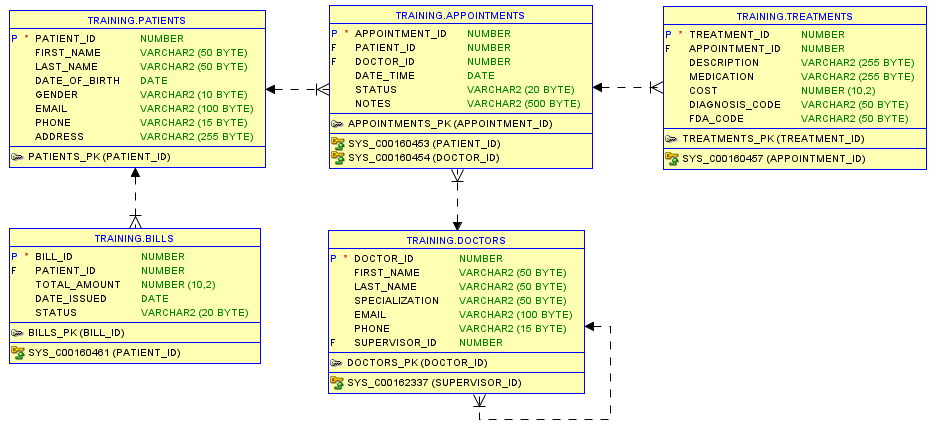
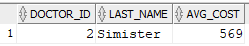
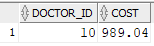
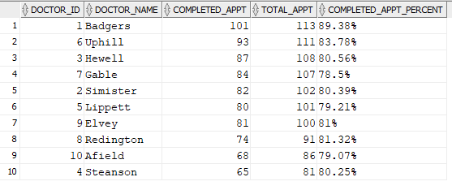

# Oracle SQL Quiz

### DB Scheme



### **Question 1:**
You want to find the doctor with the highest average treatment cost among all doctors. Write a query that uses a subquery to calculate the average treatment cost for each doctor and then identifies the doctor with the highest average cost.

**Solution:**<br/>


```sql


```


### **Question 2:**
In the `Treatments` table, each treatment has a cost associated with it. Write a query to find the doctor ID of the doctor who has performed the most expensive treatment. Display the doctor ID and the cost of the treatment.

**Solution:**



```sql


```


### **Question 3:**
The `Appointments` table in your database includes appointment statuses like 'Scheduled,' 'Completed,' and 'Cancelled.' Write a query that calculates the percentage of completed appointments for each doctor. Display the doctor ID, doctor's last name, and the calculated percentage. Exclude doctors with no completed appointments.

**Solution:**<br/>


```sql


```